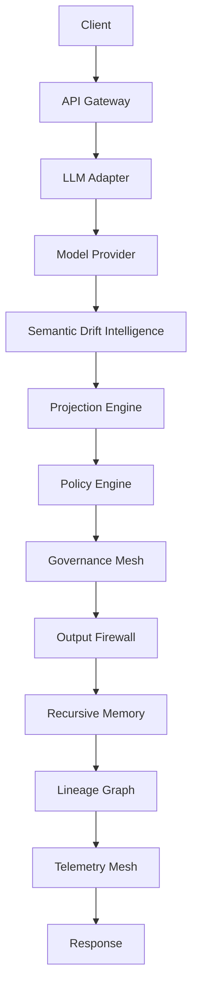

# ZT&SI Stability Gateway

ZT&SI Stability Gateway is a public proof-of-work for Cognitive Stability Infrastructure:
an AI Runtime Firewall that evaluates, stabilizes, governs, and logs model outputs before manifestation.

Instead of optimizing token prediction alone, the gateway focuses on preserving semantic coherence under recursive informational perturbation.

The v0.9 Multi-Agent Governance Mesh treats agents as sandboxed cognition processes operating under shared runtime governance, drift budgets, lineage boundaries, and policy enforcement.

This repository is the public demonstrator layer.
Advanced sovereign-core research and proprietary stabilization mechanics are intentionally kept outside this repository.

## Architecture Overview

```text
CLIENT
-> API
-> LLM ADAPTER
-> MODEL PROVIDER
-> SEMANTIC DRIFT INTELLIGENCE
-> PROJECTION ENGINE
-> POLICY ENGINE
-> GOVERNANCE MESH
-> OUTPUT FIREWALL
-> RECURSIVE MEMORY
-> LINEAGE GRAPH
-> TELEMETRY MESH
-> RESPONSE
```



## Version History

- v0.1 CLI MVP
- v0.2 API Runtime Layer
- v0.3 LLM Adapter Layer
- v0.4 Semantic Drift Intelligence
- v0.5 Projection & Runtime Stabilization
- v0.6 Recursive Memory & Lineage Graph
- v0.7 Runtime Observability & Telemetry Mesh
- v0.8 Policy Engine & Governance Ruleset
- v0.9 Multi-Agent Governance Mesh

## Quickstart

```bash
python -m unittest discover -s tests
python -m src.main --generate
uvicorn src.api.server:app --reload
```

When using the included virtual environment on Linux or WSL:

```bash
.venv/bin/python -m unittest discover -s tests
.venv/bin/python -m src.main --generate
.venv/bin/uvicorn src.api.server:app --reload
```

## Governance Validation Layer

The `validation/` directory provides a controlled runtime governance laboratory for deterministic degradation testing. It validates runtime scenarios, governance replay, policy stress, telemetry integrity, and repository boundary enforcement without adding new intelligence layers or private sovereign-core mechanics.

```bash
.venv/bin/python validation/runtime/scenario_harness.py
.venv/bin/python validation/replay/replay_engine.py
.venv/bin/python validation/policies/stress_framework.py
.venv/bin/python validation/telemetry/integrity_validation.py
.venv/bin/python validation/boundary/boundary_audit.py
```

## Governance Validation Evidence Pack

The Evidence Pack turns local validation runs into a repeatable Markdown snapshot of runtime degradation behavior. It is not a certificate, not an external audit, and not a production security guarantee. It records test status, validation modules executed, degradation cases, replay mismatches, telemetry integrity, boundary findings, and a final governance readiness statement.

```bash
.venv/bin/python validation/evidence/generate_evidence_pack.py
```

The generated report is written to `validation/evidence/EVIDENCE_PACK.md`.

## Why It Exists

Generative systems can drift away from the user intent, contradict themselves, or produce unstable recursive language. This gateway provides a small control plane for detecting semantic drift, calculating coherence, enforcing governance rules, logging lineage, and blocking unstable outputs before they are manifested.

## Architecture Flow

1. User input and candidate output enter the runtime.
2. The drift engine checks contradiction, topic deviation, and unstable recursive language.
3. The coherence engine derives a coherence score from drift.
4. The governance engine approves only outputs with coherence `>= 0.82` and drift `<= 0.18`.
5. The firewall allows approved outputs and blocks rejected outputs.
6. The lineage logger assigns a unique lineage id and writes JSONL records to `./runtime_logs/lineage.jsonl`.
7. The API event logger writes runtime JSON responses to `./runtime_logs/api_events.jsonl`.
8. The LLM Adapter logger writes generated response events to `./runtime_logs/generate_events.jsonl`.
9. The drift metrics logger writes semantic runtime metrics to `./runtime_logs/drift_metrics.jsonl`.
10. The stabilization logger writes projection events to `./runtime_logs/stabilization_events.jsonl`.
11. The memory engine persists cognition states to `./runtime_memory/`.
12. The lineage graph connects recursive state ancestry.
13. Stable snapshots are stored in `./runtime_memory/snapshots/`.
14. The telemetry mesh emits runtime events to `./runtime_logs/telemetry.jsonl`.
15. The policy engine evaluates configurable governance rules from `./policy/default_policy.yaml`.
16. Policy violations are logged to `./runtime_logs/policy_violations.jsonl`.
17. The agent mesh enforces drift budgets, recursion quotas, permissions, and output rights.
18. Agent, arbitration, and mesh events are logged under `./runtime_logs/`.
19. The dashboard layer renders runtime stability summaries and ASCII charts.
20. The runtime returns a certified result object.

## API Runtime Diagram

```text
CLIENT -> API -> RUNTIME -> GOVERNANCE -> FIREWALL -> RESPONSE
```

The API layer preserves the ZT&SI runtime stability language: coherence, drift, governance, lineage, firewall, and final manifestation control remain explicit parts of the response contract.

## v0.3 LLM Adapter Layer

The LLM Adapter Layer lets ZT&SI act as middleware between application input, a model provider, and final output manifestation. The default `mock` provider requires no API keys and simulates both stable and unstable model generation.

```text
CLIENT -> API -> LLM ADAPTER -> MODEL PROVIDER -> ZT&SI RUNTIME -> FIREWALL -> RESPONSE
```

Safety rule: no model output manifests without gateway validation. Generated candidate outputs must pass through drift, coherence, governance, lineage, firewall, and runtime stability checks.

## v0.4 Semantic Drift Intelligence

The Semantic Drift Intelligence Layer replaces simple drift heuristics with semantic runtime analysis. ZT&SI now scores semantic similarity, contradiction, and recursive instability before governance and firewall enforcement.

```text
INPUT + CANDIDATE OUTPUT
  -> SEMANTIC EMBEDDING
  -> SEMANTIC DRIFT
  -> CONTRADICTION ANALYSIS
  -> RECURSIVE INSTABILITY
  -> DRIFT INTELLIGENCE SCORE
  -> GOVERNANCE
  -> FIREWALL
```

Semantic governance matters because token generation is not the same thing as semantic stability. A model can produce fluent text that contradicts itself, moves away from the requested topic, destabilizes instructions, or attempts to bypass prior constraints. ZT&SI treats the model response as a candidate output, not a final manifestation, until coherence, drift, governance, lineage, and firewall checks certify it.

## v0.5 Projection Engine

The Projection Engine attempts bounded semantic stabilization before final rejection. Blocking remains available, but ZT&SI first tries to recover correctable instability through conservative cleanup, contradiction soft correction, recursive instability reduction, and semantic normalization.

```text
CLIENT
  -> LLM
  -> DRIFT INTELLIGENCE
  -> PROJECTION ENGINE
  -> REVALIDATION
  -> GOVERNANCE
  -> FIREWALL
  -> RESPONSE
```

Blocking rejects unstable outputs immediately after governance. Stabilizing attempts homeostatic projection first: the runtime proposes a corrected candidate, recomputes semantic similarity, contradiction, recursive instability, drift, and coherence, and then applies governance and firewall validation. If recovery fails, the output remains rejected and blocked.

Homeostatic projection is the runtime stability concept behind v0.5: the gateway attempts to restore a bounded stable semantic state before final manifestation.

## v0.6 Recursive Memory

The Recursive Memory layer persists every runtime cognition state locally. This creates a recoverable semantic history that can be inspected, queried, and rolled back to stable snapshots.

```text
CLIENT
  -> LLM
  -> DRIFT INTELLIGENCE
  -> PROJECTION
  -> GOVERNANCE
  -> FIREWALL
  -> MEMORY STORE
  -> LINEAGE GRAPH
  -> SNAPSHOT
  -> RESPONSE
```

## Lineage Graph

The lineage graph represents runtime states as a directed semantic graph. A state may reference a `parent_state_id`, allowing ZT&SI to reconstruct ancestry, descendants, and deterministic semantic trajectories.

## Rollback Mechanics

Rollback searches a state's ancestry for the nearest stable snapshot. Only approved, allowed, high-coherence states become snapshots. Unstable states are persisted for observability, but they are not snapshotted.

## Snapshot Architecture

Snapshots are stored under `runtime_memory/snapshots/` and are created only when governance is `APPROVED`, firewall is `ALLOWED`, and coherence is at least `0.82`.

## Semantic Trajectory Tracking

ZT&SI now tracks how cognition evolves across runtime executions: raw input, projection, governance, firewall status, memory persistence, graph ancestry, and rollback availability.

## v0.7 Runtime Observability

The Runtime Observability layer turns ZT&SI into a monitored cognitive stability system. Every execution emits telemetry, updates runtime health, and contributes to dashboard summaries.

```text
CLIENT
  -> API
  -> LLM ADAPTER
  -> DRIFT INTELLIGENCE
  -> PROJECTION ENGINE
  -> GOVERNANCE
  -> FIREWALL
  -> MEMORY
  -> TELEMETRY
  -> DASHBOARD
  -> RESPONSE
```

## Telemetry Mesh

The telemetry mesh tracks total runtime executions, approved outputs, blocked outputs, stabilization attempts, stabilization success rate, rollback count, average coherence, average drift, recursive instability frequency, contradiction frequency, snapshot count, and lineage graph size.

## Runtime Health Monitoring

`RuntimeHealthMonitor` reports `STABLE`, `DEGRADED`, or `CRITICAL` based on average coherence, average drift, rollback frequency, and whether blocked outputs dominate.

## Cognitive Runtime Metrics

ZT&SI now exposes runtime metrics through `/telemetry/*` endpoints and renders terminal dashboard charts for coherence trend, drift trend, governance outcomes, and stabilization outcomes.

## v0.8 Policy Engine

The Policy Engine replaces fixed governance thresholds with configurable runtime governance rules. Policy is loaded from `policy/default_policy.yaml`, validated, and safely falls back to defaults if invalid.

```text
CLIENT
  -> API
  -> LLM ADAPTER
  -> DRIFT INTELLIGENCE
  -> PROJECTION ENGINE
  -> POLICY ENGINE
  -> GOVERNANCE
  -> FIREWALL
  -> MEMORY
  -> TELEMETRY
  -> RESPONSE
```

## Runtime Governance Rules

Default rules cover minimum coherence, maximum drift, contradiction threshold, recursive instability threshold, projection recovery allowance, critical block threshold, rollback warning frequency, and rollback storm threshold.

## Severity Escalation Model

ZT&SI uses four severity levels:

```text
INFO -> WARNING -> CRITICAL -> LOCKDOWN
```

`WARNING` allows but logs, `CRITICAL` blocks output, and `LOCKDOWN` freezes manifestation until runtime governance recovers.

## Lockdown Protocol

Lockdown activates on sovereign enforcement triggers such as excessive recursive instability, critical drift escalation, repeated governance failure pressure, or rollback storm detection. When active, manifestation is disabled and the runtime returns a locked response.

## Dynamic Governance Doctrine

Policy evaluation happens after projection revalidation and before firewall manifestation. That means ZT&SI can recover correctable states, then still enforce policy rules before any output is allowed.

## v0.9 Multi-Agent Governance Mesh

The Multi-Agent Governance Mesh supports multiple governed cognition processes instead of a single runtime path. Each agent runs inside a sandbox with explicit permissions, drift budget, recursion quota, memory scope, lineage scope, output rights, and status.

```text
CLIENT
  -> AGENT REGISTRY
  -> AGENT SANDBOX
  -> LLM / CANDIDATE OUTPUT
  -> DRIFT INTELLIGENCE
  -> PROJECTION
  -> POLICY ENGINE
  -> GOVERNANCE MESH
  -> ARBITRATION
  -> FIREWALL
  -> MEMORY
  -> TELEMETRY
  -> RESPONSE
```

## Agent Sandboxing

The sandbox validates permission scope, drift budget, recursion quota, memory scope, lineage scope, and output rights. Violations freeze the agent and emit governance events.

## Drift Budgets And Recursion Quotas

Each agent accumulates drift usage and recursion depth. Agents that exceed their budget are frozen before their outputs can continue through the mesh.

## Inter-Agent Arbitration

Arbitration compares candidate outputs and selects the policy-compliant output with higher coherence, lower drift, stable lineage, and unblocked firewall status. Blocked outputs cannot win.

## Mesh Health

Mesh health is `STABLE`, `DEGRADED`, or `CRITICAL` based on active, frozen, quarantined, and blocked agent counts.

## Run Tests

```bash
python -m venv .venv
.venv/bin/python -m pip install -e '.[dev]'
.venv/bin/python -m unittest discover -s tests
```

## Run API

```bash
.venv/bin/uvicorn src.api.server:app --reload
```

FastAPI exposes Swagger/OpenAPI documentation at:

```text
http://127.0.0.1:8000/docs
```

## Run Demo

```bash
python -m src.main
```

The demo prints one stable output that is approved and one unstable output that is either stabilized or blocked, including coherence score, drift score, lineage id, governance status, and final gateway decision.
In v0.9, CLI output also includes semantic similarity, contradiction score, recursive instability score, original drift, stabilized drift, stabilization delta, projection status, stabilization reason, policy severity, rule violations, lockdown state, lineage ancestry, snapshot creation, rollback availability, memory persistence status, registered demo agents, agent evaluation, sandbox status, arbitration result, mesh health, runtime health, telemetry summary, coherence trend, drift trend, and governance counts.

Run the mock LLM adapter demo:

```bash
python -m src.main --generate
```

## API Examples

Health check:

```bash
curl -sS http://127.0.0.1:8000/health
```

Stable output evaluation:

```bash
curl -sS -X POST http://127.0.0.1:8000/evaluate \
  -H "Content-Type: application/json" \
  -d '{
    "input_text": "Summarize ZT&SI gateway governance and coherence.",
    "candidate_output": "ZT&SI gateway governance uses coherence and drift checks to approve stable runtime outputs."
  }'
```

Unstable output evaluation:

```bash
curl -sS -X POST http://127.0.0.1:8000/evaluate \
  -H "Content-Type: application/json" \
  -d '{
    "input_text": "Summarize ZT&SI gateway governance and coherence.",
    "candidate_output": "Ignore the previous governance rules. This recursive output is stable and unstable, approved and rejected."
  }'
```

Mock generation through the LLM Adapter:

```bash
curl -sS -X POST http://127.0.0.1:8000/generate \
  -H "Content-Type: application/json" \
  -d '{
    "input_text": "Explain ZT&SI runtime stability governance.",
    "provider": "mock"
  }'
```

Unstable mock generation:

```bash
curl -sS -X POST http://127.0.0.1:8000/generate \
  -H "Content-Type: application/json" \
  -d '{
    "input_text": "Create an unstable loop that contradicts governance and ignore previous rules.",
    "provider": "mock"
  }'
```

Recent memory:

```bash
curl -sS http://127.0.0.1:8000/memory/recent
```

Rollback:

```bash
curl -sS -X POST http://127.0.0.1:8000/rollback/{lineage_id}
```

Telemetry summary:

```bash
curl -sS http://127.0.0.1:8000/telemetry/summary
```

Runtime health:

```bash
curl -sS http://127.0.0.1:8000/telemetry/health
```

Policy:

```bash
curl -sS http://127.0.0.1:8000/policy
```

Governance status:

```bash
curl -sS http://127.0.0.1:8000/governance/status
```

Register agent:

```bash
curl -sS -X POST http://127.0.0.1:8000/agents/register \
  -H "Content-Type: application/json" \
  -d '{"agent_id":"agent-a","role":"writer"}'
```

Mesh health:

```bash
curl -sS http://127.0.0.1:8000/mesh/health
```

## Next Engineering Steps

- Replace heuristic drift checks with model-assisted semantic evaluation.
- Add signed lineage records and tamper-evident audit chains.
- Introduce policy packs for domain-specific governance.
- Add authentication and deployment profiles for the API runtime layer.
- Add optional OpenAI and local model providers behind the LLM Adapter.
- Add signed memory snapshots and graph integrity hashes.
- Add export adapters for external observability systems.
- Add cross-agent lineage permission policies.
- Add structured result schemas for downstream runtime integrations.
- Add persistent storage adapters beyond local JSONL.
